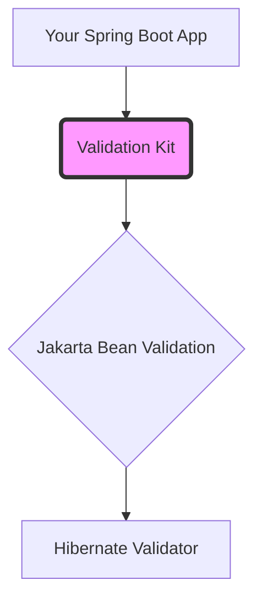

# Validation Kit

[](https://central.sonatype.com/artifact/io.github.validationkit/validation-spring-boot-starter)
[](https://opensource.org/licenses/MIT)
[](https://adoptium.net/)

A lightweight **extension** for **Jakarta Bean Validation** (Hibernate Validator) that **bridges the gap** between standard specifications and complex business logic. 

Validation Kit works harmoniously alongside standard annotations like `@NotBlank`, `@Size`, and `@Email`, providing high-value custom constraints where the standard spec stops.

## The Gap We Fill

| Standard Jakarta | Gap | Validation Kit |
| :--- | :--- | :--- |
| `@Pattern` | Complex Regex | `@StrongPassword`, `@FileExtension` |
| `@NotNull` | Values Config | `@AllowedValues` |
| Manual Checks | Boilerplate | `@Base64` |



## Installation

Add the dependency to your `pom.xml`:

```xml
<dependency>
    <groupId>io.github.validationkit</groupId>
    <artifactId>validation-spring-boot-starter</artifactId>
    <version>0.0.2</version>
</dependency>
```

## Quick Start

### 1. Define your DTO
Combine standard Jakarta annotations (like `@NotBlank`) with Validation Kit extensions:

```java
public class UserRequest {

    @NotBlank
    private String username;

    @AllowedValues(value = {"admin", "user", "guest"}, message = "Role must be one of {value}")
    private String role;

    @FileExtension(value = {"jpg", "png"})
    private String profileImage;
}
```

### 2. Use in Controller

```java
@PostMapping("/users")
public void createUser(@Valid @RequestBody UserRequest request) {
    // ...
}
```

### 3. (Optional) Configuration

In `application.yml`:

```yaml
validation:
  errors:
    enabled: true # Enable the global exception handler
    include-allowed-values: false # Set to true to include the [admin, user, guest] list in the error message
```

## Error Response Format

```json
{
  "status": 400,
  "message": "Validation failed",
  "errors": [
    {
      "field": "role",
      "code": "AllowedValues",
      "message": "Role must be one of {value}"
    }
  ]
}
```

## Annotation Reference

### `@AllowedValues`
Validates that a field is one of the allowed strings.
- **Supported types:** `String`, `Object` (toString), `Collection<?>`, `Object[]`.

```java
@AllowedValues(value = {"admin", "user"}, caseSensitive = false)
private String role;
```

**Attributes:**
- `value` (required): Array of allowed string values.
- `caseSensitive` (default: `true`): Whether the check matches case.
- `acceptNull` (default: `true`): Whether `null` is considered valid (standard Bean Validation behavior). Use `@NotNull` to reject nulls.

### `@Base64`
Validates that a string is a valid Base64 encoded sequence using `java.util.Base64`.

```java
@Base64
private String encodedData;
```

### `@FileExtension`
Validates that a string (filename) ends with one of the allowed extensions.

```java
@FileExtension(value = {"jpg", "png", "pdf"}, caseSensitive = false)
private String filename;
```

**Attributes:**
- `value` (required): Array of allowed extensions (e.g., "jpg", "pdf").
- `caseSensitive` (default: `false`): Whether checking against the extension list is case-sensitive.

### `@StrongPassword`
Validates password complexity with configurable rules.

```java
public class PasswordRequest {

    // Default: min=8, requires uppercase, lowercase, digit, special char
    @StrongPassword
    private String password;

    // Custom configuration
    @StrongPassword(
        min = 12, 
        hasSpecialChar = false, 
        hasDigit = true, 
        allowedSpecialChars = "@#",
        message = "Password criteria not met"
    )
    private String pin;
}
```

**Attributes:**
- `min` (default: `8`): Minimum length.
- `max` (default: `Integer.MAX_VALUE`): Maximum length.
- `hasUppercase` (default: `true`): Requires at least one uppercase letter.
- `hasLowercase` (default: `true`): Requires at least one lowercase letter.
- `hasDigit` (default: `true`): Requires at least one digit.
- `hasSpecialChar` (default: `true`): Requires at least one special character.
- `allowedSpecialChars` (default: `"@$!%*?&_#-"`): The set of allowed special characters (used only if `hasSpecialChar` is true).


## License

MIT
